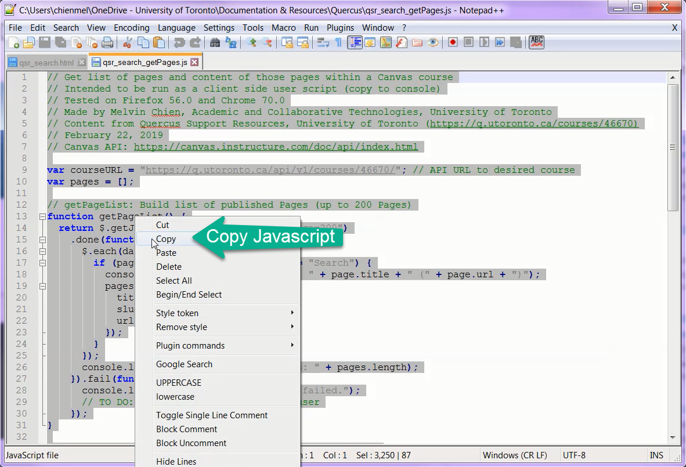
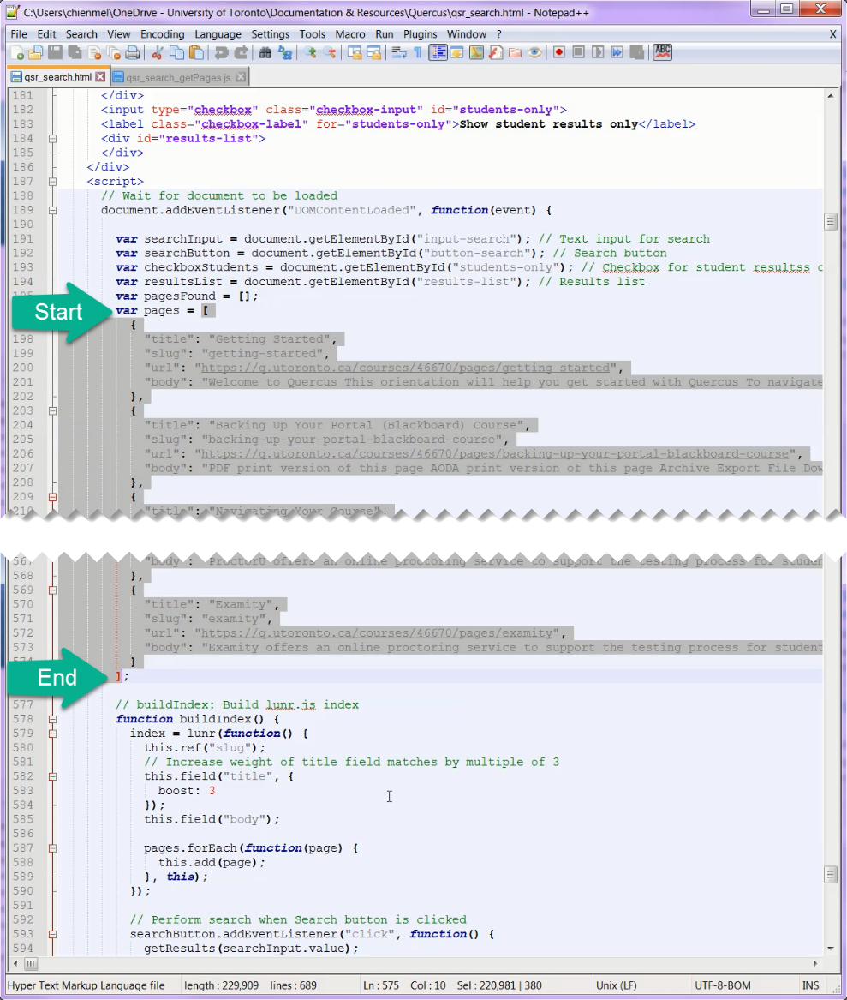
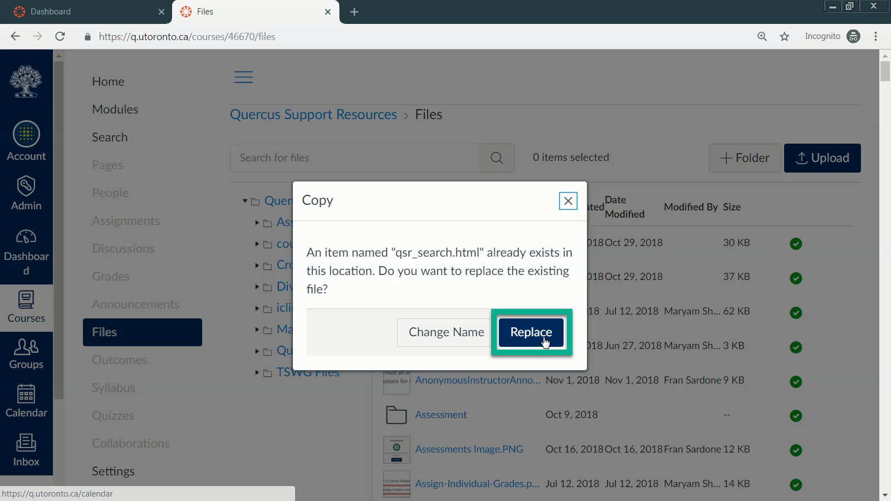

# Quercus Support Resources Search
Search functionality for a Canvas course with no backend databases or servers and minimal dependencies.  
Tested on Firefox 56.0, Chrome 70.0, and Internet Explorer 11.  

## Table of Contents
- [Credits](#credits)  
- [Installation](#installation)  
    - [Variables](#variables)  
    - [Setup](#setup)  
- [Maintenance](#maintenance)  

## Credits
Built using [lunr.js](https://lunrjs.com/docs/index.html).  
Content from [Quercus Support Resources, University of Toronto](https://q.utoronto.ca/courses/46670).  
Uses the [Canvas API](https://canvas.instructure.com/doc/api/index.html) provided by Instructure.  

## Installation
### Variables
#### qsr_search_getPages.js
`var courseURL` - Link to the [Canvas Courses API](https://canvas.instructure.com/doc/api/courses.html#method.courses.show) for a single course.  
`link.download` - Name of the downloaded JSON file.

#### qsr_search_pages.json
None

#### qsr_search.html
`gtag` - Google Analytics Property ID. Used in 4 separate instances.

#### qsr_page_iframe.html
`iframe src` - Download link to the `qsr_search.html` file uploaded within the Canvas course. *Can only be retrieved after the file has actually been uploaded to the Canvas course's Files.*

### Setup
*Make sure the variables above are updated and corrected before proceeding.*
1. Copy entire contents of `qsr_search_getPages.js`.
   
2. Using Chrome, sign into Canvas and open the Developer Console (F12).
3. Paste the code and press Enter.
4. Verify that the ouput displays `"SUCCESS: ..."` and `qsr_search_pages.json` is automatically downloaded.
   
5. Copy entire contents of `qsr_search_pages.json` and paste into `var pages` in `qsr_search.html`.
   
6. Upload `qsr_search.html` into Canvas course.
   
7. In a new or existing Canvas Page, insert the iframe code from `canvas_page_snippet.html`.
8. Test the search functionality in the Canvas Page.

## Maintenance
As this tool does not have a backend, the search index data must be manually updated as needed.  
See [Update QSR Search.docx](docs/Update%20QSR%20Search.docx) or watch a [video tutorial](https://youtu.be/CoIv780_sls) for more info.
